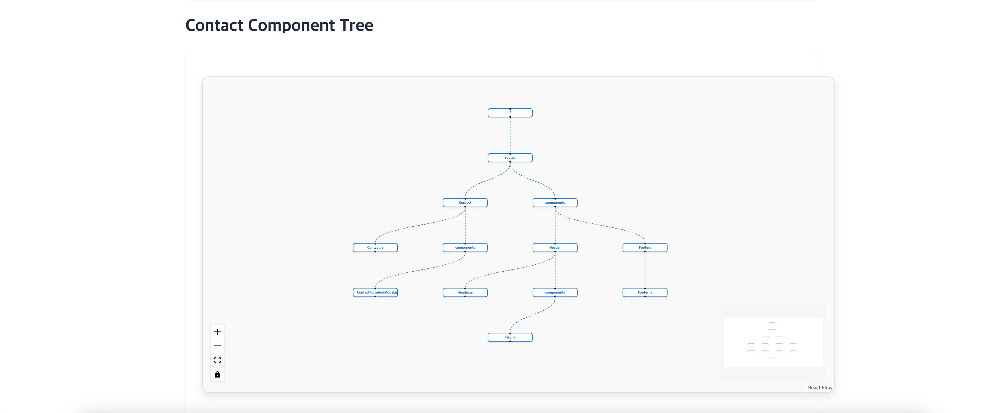

# VisualizationReactTree

[English](README_EN.md) | [한국어](README_KO.md)

  <h1>VisualizationReactTree</h1>
  
React/Next.js Component Tree Visualization Tool

---

### Folder Tree

### Component Tree

### Demo

Please select your preferred language:

- [English Documentation](README_EN.md)
- [한국어 문서](README_KO.md)
